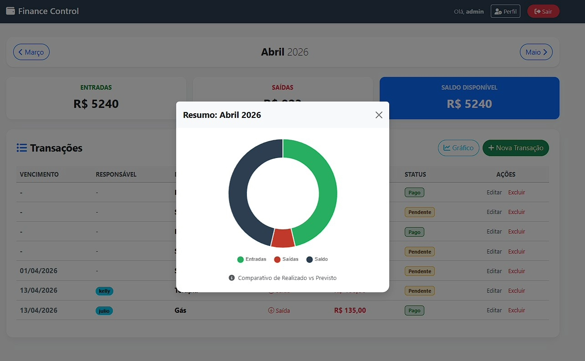

# 💰 Finance Control - Gestão Financeira Inteligente

Sistema web de alta performance para gerenciamento financeiro pessoal, desenvolvido com **Django**. O projeto soluciona a organização de fluxos de caixa através de uma arquitetura robusta e interface orientada à experiência do usuário (UX).

---

## 🚀 Diferenciais e Autoridade Técnica

Diferente de sistemas básicos, este projeto implementa:
- **Arquitetura MVT (Model-View-Template):** Separação rigorosa de responsabilidades, garantindo facilidade na manutenção e escalabilidade.
- **Server-Side Rendering (SSR):** Processamento lógico de saldos e filtragem temporal realizado integralmente no backend, entregando um HTML otimizado e seguro ao cliente.
- **Data Visualization:** Integração estratégica de **JavaScript (Chart.js)** para transformar dados brutos em insights visuais (Entradas vs. Saídas).
- **Segurança de Dados:** Implementação de proteção contra ataques CSRF e validação de integridade via Django Forms e ORM.

---

## 📸 Demonstração e Interface

| Dashboard Mensal | Análise com Gráficos |
| :---: | :---: |
|  |  |

| Gestão de Lançamentos | Edição e Exclusão |
| :---: | :---: |
|  |  |

---

## 🛠️ Stack Tecnológica

- **Core:** Python 3.x / Django (Framework Full-stack)
- **Frontend:** Bootstrap 5 (UI/UX Responsivo), FontAwesome (Iconografia)
- **Database:** SQLite3 (Desenvolvimento) / Preparado para PostgreSQL
- **Analytics:** Chart.js (Visualização de dados dinâmica)

---

## 🏗️ Estrutura Arquitetural

O projeto segue um padrão de organização modular, facilitando a portabilidade e manutenção:

```text
FINANCE_CONTROL/
├── core/           # Kernel do sistema (Settings, URLs globais)
├── finance/        # Business Logic (Models, Views de processamento, Forms)
├── templates/      # Camada de apresentação com Herança de Templates (DRY)
└── static/         # Assets estáticos (Custom CSS, JS, Imagens)