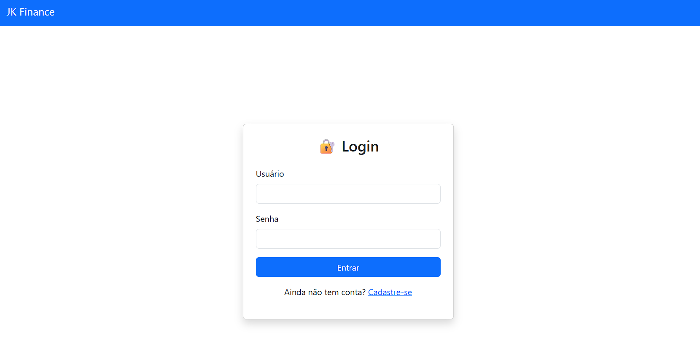
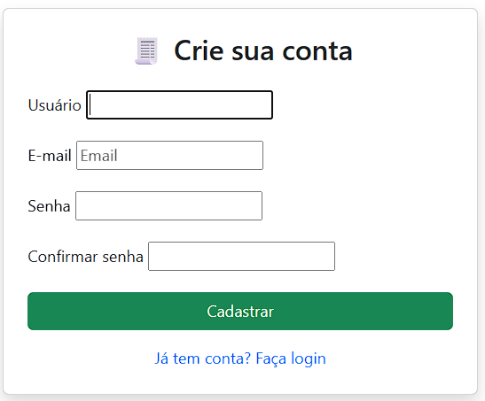
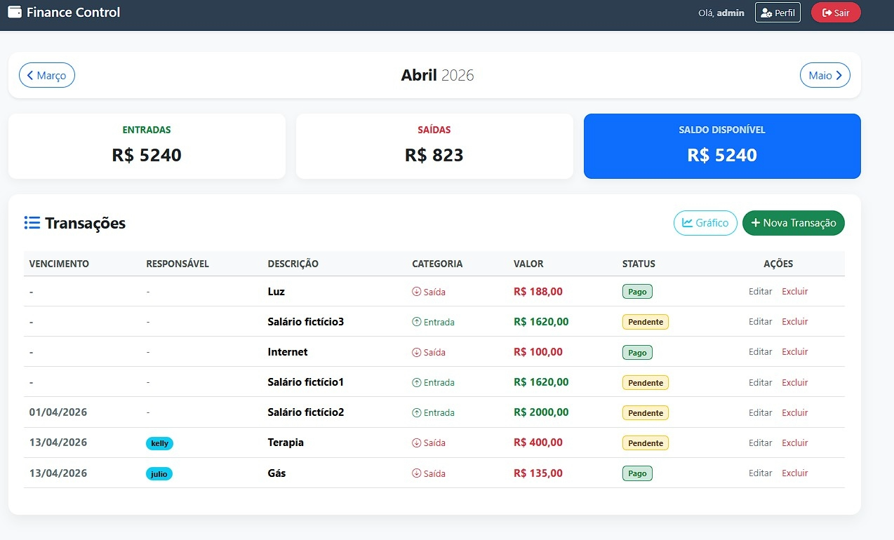
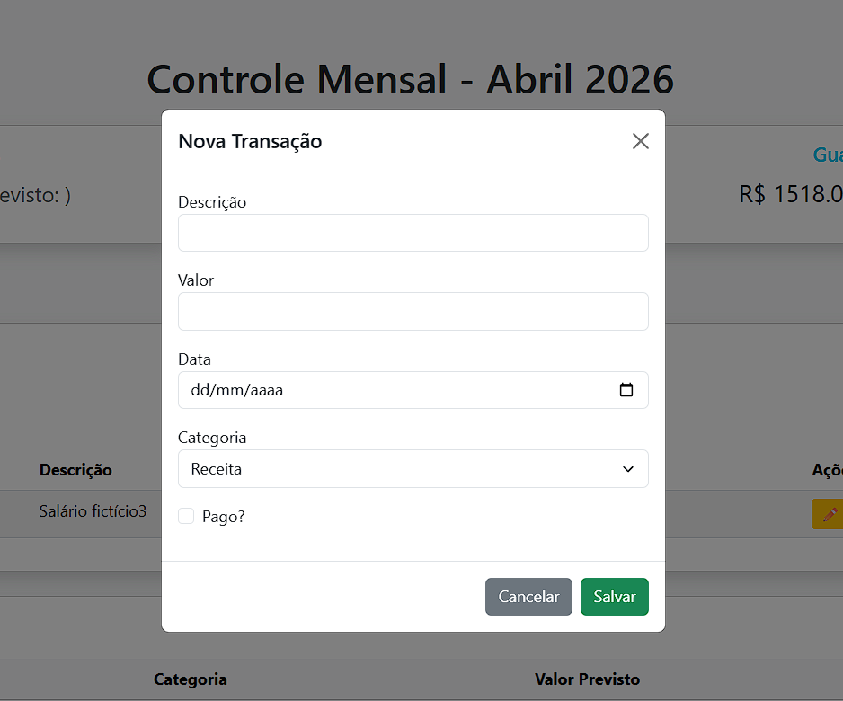

# 💰 Finance Control

Sistema web de gerenciamento financeiro desenvolvido com Django.

O projeto permite controle de receitas, despesas e organização financeira pessoal através de uma interface web simples e funcional.

---

## Status do Projeto
Versão inicial funcional com CRUD completo de receitas e despesas. Projeto em evolução — novas funcionalidades estão sendo implementadas continuamente.

## Tecnologias Utilizadas

- Python 3
- Django
- Bootstrap
- SQLite3
- HTML5
- CSS3
- JavaScript

---

## Estrutura do Projeto
FINANCE_CONTROL/
│
├── core/ # Configurações principais do projeto
│ ├── settings.py
│ ├── urls.py
│ ├── views.py
│ └── context_processors.py
│
├── finance/ # App principal de controle financeiro
│ ├── models.py
│ ├── views.py
│ ├── forms.py
│ ├── admin.py
│ ├── templates/
│ └── static/
│
├── manage.py
└── README.md

---

## Funcionalidades

- Cadastro de receitas
- Cadastro de despesas
- Listagem de lançamentos
- Interface responsiva com Bootstrap
- Organização por categorias
- Integração com Django Admin

---
## Arquitetura

 O projeto segue a arquitetura MTV (Model-Template-View) do Django, 
 com separação clara entre regras de negócio, camada de apresentação e configuração do sistema.

---

## Screenshots

### Tela de Login

### Cadastro de Usuários

### Dashboard

### Cadastro de Lançamentos

---

## Como Executar o Projeto

### 1 Clone o repositório
git clone https://github.com/jmattosinfo/finance-control.git

### 2️ Acesse a pasta do projeto
cd FINANCE_CONTROL

### 3️ Crie e ative o ambiente virtual
python -m venv venv
venv\Scripts\activate # Windows

### 4️ Instale as dependências
pip install -r requirements.txt

### 5️ Execute as migrações
python manage.py migrate

### 6️ Rode o servidor
python manage.py runserver

Acesse no navegador: http://127.0.0.1:8000/

---

## Objetivo do Projeto

Este projeto foi desenvolvido com foco em:

- Aprendizado prático de Django
- Estruturação de aplicações seguindo o padrão MTV do Django
- Organização de apps e templates
- Boas práticas de desenvolvimento web

---

## 📈 Melhorias Futuras

- Implementação de API REST com Django REST Framework
- Autenticação de usuários
- Dashboard com gráficos financeiros
- Migração para arquitetura Java + Spring Boot + React

---

## 👨‍💻 Autor

Julio César de Mattos Vieira  
Desenvolvedor em formação

---
