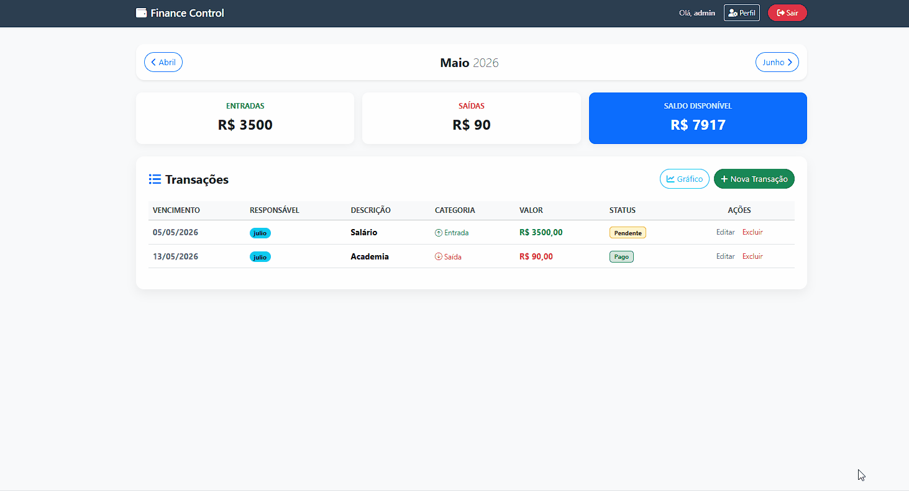
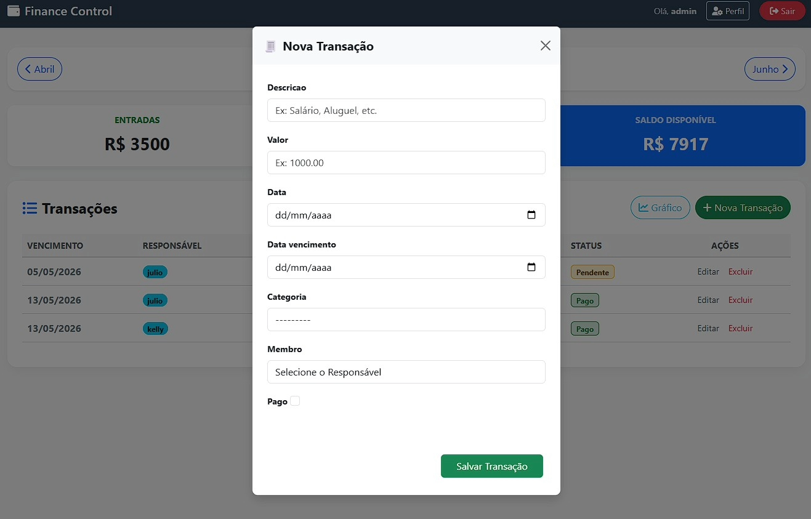
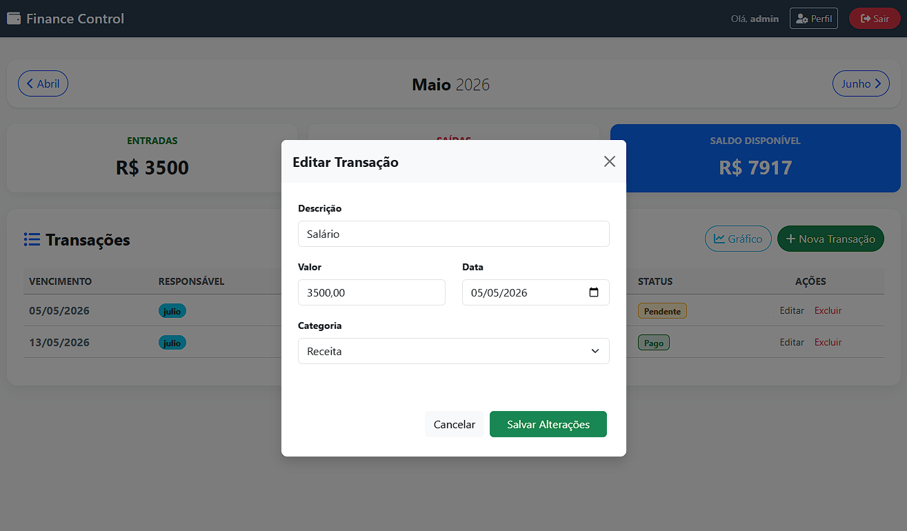

# 💰 Finance Control - Gestão Financeira Inteligente

Sistema web de alta performance para gerenciamento financeiro pessoal, desenvolvido com **Django**. O projeto soluciona a organização de fluxos de caixa através de uma arquitetura robusta e interface orientada à experiência do usuário (UX).

---

## 🎬 Demonstração em Tempo Real

Aqui você pode observar o fluxo de funcionamento do sistema, incluindo a abertura de modais dinâmicos e a renderização de gráficos:



---

## 🚀 Diferenciais e Autoridade Técnica

Diferente de sistemas básicos, este projeto implementa:
- **Arquitetura MVT (Model-View-Template):** Separação rigorosa de responsabilidades, garantindo facilidade na manutenção e escalabilidade.
- **Django REST Framework (DRF):** Implementação de API para interoperabilidade, permitindo a futura integração com ecossistema **Java + Spring Boot** e **React Native**.
- **Server-Side Rendering (SSR):** Processamento lógico de saldos e filtragem temporal realizado integralmente no backend, entregando um HTML otimizado e seguro ao cliente.
- **Data Visualization:** Integração estratégica de **JavaScript (Chart.js)** para transformar dados brutos em insights visuais (Entradas vs. Saídas).
- **Segurança de Dados:** Implementação de proteção contra ataques CSRF e validação de integridade via Django Forms e ORM.

---

## 📸 Interface e visualização

| Dashboard Mensal | Análise com Gráficos |
| :---: | :---: |
|  |  |

| Gestão de Lançamentos | Edição e Exclusão |
| :---: | :---: |
|  |  |

---

## 🛠️ Stack Tecnológica

- **Core:** Python 3.x / Django (Framework Full-stack) / Django REST Framework
- **Frontend:** Bootstrap 5 (UI/UX Responsivo), FontAwesome (Iconografia)
- **Database:** SQLite3 (Desenvolvimento) / Preparado para PostgreSQL
- **Analytics:** Chart.js (Visualização de dados dinâmica)

---

## 🏗️ Estrutura Arquitetural

O projeto segue um padrão de organização modular, facilitando a portabilidade e manutenção:

```text
FINANCE_CONTROL/
├── core/           # Kernel do sistema (Settings, URLs globais)
├── finance/        # Business Logic (Models, Views, Serializers, Forms)
│   ├── migrations/ # Histórico de versões do banco de dados
│   ├── static/     # Assets estáticos (Custom CSS, JS)
│   └── templates/  # Camada de apresentação com Herança de Templates (DRY)
├── assets/         # Mídias de documentação (Imagens e GIFs)
├── manage.py       # Utilitário de linha de comando do Django
└── requirements.txt # Gerenciamento de dependências

```

---

## ⚙️ Engenharia de Execução (Instruções)

**Siga os passos abaixo para configurar o ambiente de desenvolvimento localmente:**

**1. Clonagem e Ambiente**
```text
git clone [https://github.com/jmattosinfo/finance-control.git](https://github.com/jmattosinfo/finance-control.git)
cd FINANCE_CONTROL
python -m venv venv
```
### Ativação Windows:
```text 
venv\Scripts\activate 
```
### Ativação Linux/Mac:
```text
source venv/bin/activate
```
**2. Instalação e Setup**

### Instala as dependências (Django, DRF, CORS-headers)
```text
pip install -r requirements.txt
```
### Executa as migrações do banco de dados
```text
python manage.py migrate
```
### Inicia o servidor
```text
python manage.py runserver
```
O sistema estará disponível em: http://127.0.0.1:8000/

A API REST estará disponível em: http://127.0.0.1:8000/api/transacoes/

## 📈 Roadmap de Evolução

- [x] Dashboard dinâmico com integração de Gráficos (Chart.js).

- [x] Implementação de API REST com Django REST Framework (DRF).

- [ ] Implementação de autenticação via Token/JWT.

- [ ] Containerização com Docker.

- [ ] Migração planejada para backend em Java Spring Boot.

### 👨‍💻 Autor
Julio César de Mattos Vieira

Desenvolvedor de Software | Especialista em Suporte e Infraestrutura

 [LinkedIn](https://linkedin.com/in/juliomattos-dev) | [GitHub](https://github.com/jmattosinfo)